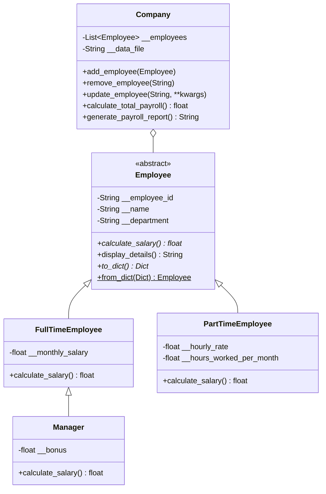

# Employee Management System
## Live Demo
https://employee-managment-system-ayie.onrender.com

## Project Overview
This is a complete, professional, and production-ready Employee Management System built in Python. It demonstrates core Object-Oriented Programming (OOP) concepts, robust file handling, exception management, and a clean, menu-driven CLI UI using Colorama.

## Features
- **CRUD Operations**: Add, View, Update, and Remove employees.
- **Dynamic Search**: Search employees by ID, Name, or Department.
- **Auto-Save**: All changes are automatically persisted to `employees.json`.
- **Advanced Reporting**: Generate and export full payroll reports (`payroll_report.txt`).
- **Statistics Dashboard**: View department summaries, average salaries, and employee counts.
- **Sorting**: Sort records dynamically by Name (A-Z) or Salary (High to Low).
- **Clean UI**: Beautiful ASCII banner, colored console output, and loading animations.

## Concepts Used
- **Encapsulation**: Private attributes (e.g., `__employee_id`) exposed via `@property` getters and setters to enforce validation (no negative salaries, no empty strings).
- **Inheritance**: `FullTimeEmployee` and `PartTimeEmployee` inherit from the `Employee` base class. `Manager` inherits from `FullTimeEmployee`.
- **Polymorphism**: The `calculate_salary()` method is overridden in subclasses but called uniformly from the `Company` class without type-checking. The `from_dict()` factory method dynamically creates correct subclass instances.
- **Abstraction**: The `Employee` class is an Abstract Base Class (`ABC`) with abstract methods like `calculate_salary()`, forcing subclasses to provide implementations.
- **File Handling**: Uses `json` module for serialization and deserialization of objects.
- **Exception Handling**: Gracefully handles `ValueError` for bad inputs, `JSONDecodeError` for corrupted files, and `KeyboardInterrupt` for user cancellations.

## Class Diagram


## How to Run
1. Ensure you have Python 3.8+ installed.
2. Install requirements:
   ```bash
   pip install -r requirements.txt
   ```
3. Run the application:
   ```bash
   python main.py
   ```

## Example Output
```
  ______                 _                         __  __                                              _   
 |  ____|               | |                       |  \/  |                                            | |  
 | |__   _ __ ___  _ __ | | ___  _   _  ___  ___  | \  / | __ _ _ __   __ _  __ _  ___ _ __ ___   ___| |_ 
 ...
==================================================================
      WELCOME TO THE NEXT-GEN EMPLOYEE MANAGEMENT SYSTEM      
==================================================================
...
```
